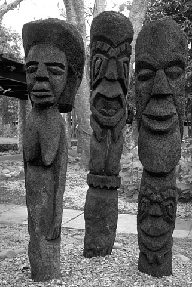

# tensorflow-DCT2d

A simple implementation of dct2d/idct2d transformation with tensorflow op, compatible with MATLAB dct2 and idct2.

There will be some loss of float numerical accuracy.

### Results ###

||
|
|:----------:|:-------------:|
|  **Input**  | **idct2d output** |
